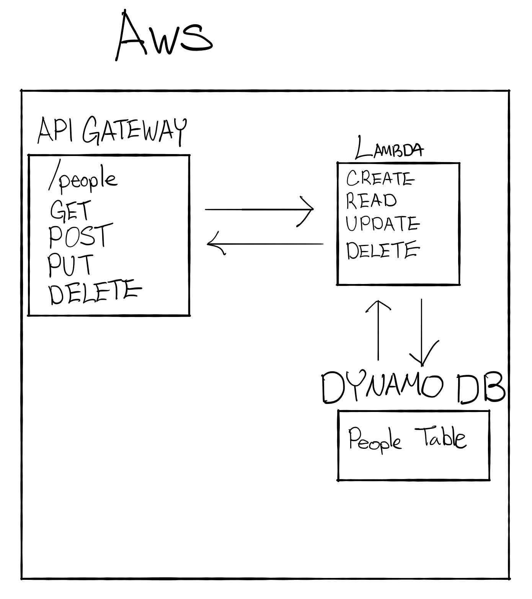

# LAB - Class 18

## Project: AWS: API, Dynamo and Lambda

### Author: Ellis Yoo

### Links and Resources

- [route](https://kiwkhy584k.execute-api.us-west-2.amazonaws.com/people)

#### How to initialize/run your application (where applicable)

- The _people_ table has an id, name, and contact.
- To get all the items in the table simply click the link above. It returns an array of items that are stored in the database.
- In order to get a specific item, after the url a query parameter is needed specifying the id. Such as `.com/people?id={id number}`. This returns a single object with the properties set above.
- Items can be posted to the database by performing a post request. It returns the added object.
- To update an item within the database, add the data that needs to be updated into the body and add a query parameter with an id to specify the item. This returns the updated object.
- To delete an item, do a delete request, specifying the item id that needs to be deleted. This returns a message that the item was successfully deleted.

#### UML / Application Wiring Diagram

